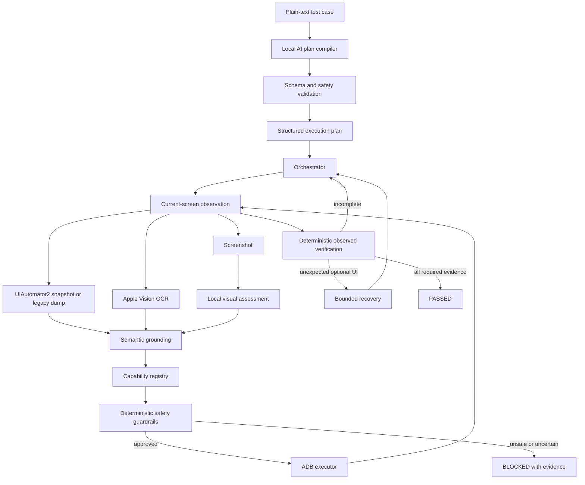

# Mobile AI Testing Agent — Local Plan-Driven PoC

This proof of concept executes human-written Android test cases on a real
device while keeping AI inference local. A test case remains plain text; a
local Ollama model compiles it into a bounded JSON execution plan. Generic
capabilities execute that plan using UIAutomator hierarchy, screenshots, Apple
Vision OCR, deterministic safety gates, and ADB.

### Hierarchy backend for busy screens

Install the optional UIAutomator2 backend in the same Python environment:

```bash
python3 -m pip install -r requirements-hierarchy.txt
python3 -m src.main --case cases/33271749-sort-restaurants-list.txt --hierarchy-backend uiautomator2
```

UIAutomator2 starts its device-side automation service over ADB; it does not
require changes to the app under test. The first connection can take longer.
The runner sets `waitForIdleTimeout=0`, requests uncompressed XML, and retains
resource IDs and parent relationships. A separate worker bounds each snapshot
to 25 seconds and rejects empty/malformed XML. Actions still use ADB; disabling
idle waits does not prove UI stability or make an assertion pass.

The default `--hierarchy-backend auto` prefers UIAutomator2 when installed;
otherwise it uses `adb`. Use `--hierarchy-backend adb` for comparison runs.
Do not run both automation backends concurrently on the same device.
Service failure uses a fresh screenshot/OCR fallback instead of opening a
competing legacy UIAutomation session. Backend timing and stdout/stderr are
recorded in `NN-dump-commands.jsonl`. Legacy idle-state failures stop identical
retries immediately; other legacy failures retain bounded retries.

The design deliberately separates two concerns:

- **AI decides intent:** translate the test case, understand unfamiliar UI,
  ground semantic targets, and suggest recovery.
- **Deterministic code controls effects:** validate the plan, constrain actions,
  execute ADB, limit retries, and require evidence before `PASSED`.

## Architecture



## Plan compilation example

Example input:

```text
Open Restaurants.
Ensure row view is selected using the right toggle option.
Change to card view using the left toggle option.
Verify that restaurant items change layout.
Scroll down the restaurant list.
```

Example compiled plan:

```json
{
  "version": 1,
  "name": "Row view to card view",
  "steps": [
    {
      "id": "open-restaurants",
      "capability": "tap",
      "role": "action",
      "target": "Restaurants",
      "hints": ["restaurants", "restaurantsVertical"],
      "value": "",
      "position": "none",
      "direction": "none",
      "optional": false,
      "success": "Restaurants listing is visible"
    },
    {
      "id": "recover",
      "capability": "recover_optional",
      "role": "recovery",
      "target": "",
      "hints": [],
      "value": "",
      "position": "none",
      "direction": "none",
      "optional": true,
      "success": "Foreground is unobstructed"
    },
    {
      "id": "setup-row",
      "capability": "set_control",
      "role": "setup",
      "target": "listing layout",
      "hints": ["layout", "toggle"],
      "value": "row",
      "position": "right",
      "direction": "none",
      "optional": false,
      "success": "Initial row layout is established"
    },
    {
      "id": "select-card",
      "capability": "set_control",
      "role": "action",
      "target": "listing layout",
      "hints": ["layout", "toggle"],
      "value": "card",
      "position": "left",
      "direction": "none",
      "optional": false,
      "success": "Card layout is requested"
    },
    {
      "id": "verify-layout",
      "capability": "assert_changed",
      "role": "assertion",
      "target": "restaurant items",
      "hints": ["restaurant", "vendor"],
      "value": "",
      "position": "none",
      "direction": "none",
      "optional": false,
      "success": "Restaurant-item geometry changed"
    },
    {
      "id": "scroll-list",
      "capability": "scroll",
      "role": "action",
      "target": "restaurant list",
      "hints": ["vendorsRecycler", "recycler"],
      "value": "",
      "position": "none",
      "direction": "down",
      "optional": false,
      "success": "The list moved"
    },
    {
      "id": "verify-scroll",
      "capability": "assert_scrolled",
      "role": "assertion",
      "target": "restaurant list",
      "hints": ["vendorsRecycler", "recycler"],
      "value": "",
      "position": "none",
      "direction": "none",
      "optional": false,
      "success": "Moved or additional restaurant content is visible"
    }
  ]
}
```

The compiled plan is saved as `plan.json` in every run artifact directory.
If deterministic validation finds a malformed semantic field, the compiler
returns the exact validation error to the local model and allows up to two
bounded JSON-repair attempts. Device execution never starts until one complete
plan passes validation.

For two-option controls, the capability also extracts explicit vocabulary
such as `row view (right toggle option)` and `card view (left toggle option)`.
This produces the deterministic mapping `right=row` and `left=card`, which can
fill a model-omitted `value` or `position` without parsing a TestRail title or
hard-coding product-specific state names. No relationship is inferred when the
plain text does not explicitly associate the state and side.

The compiler also validates relationships across steps. An explicit
`from row view to card view` transition binds setup to `row/right` and the
tested action to `card/left`, even if a small local model puts those values in
the wrong JSON fields. Non-applicable fields are cleared, both control steps
are bound to one control, and every `scroll`/`set_control` receives a required
observed assertion before the plan is considered executable.
The relationship is bidirectional: when the plain text explicitly requests a
scroll and the model emits only `assert_scrolled`, the compiler restores the
missing `scroll` action immediately before that assertion. An orphan
`assert_scrolled` can therefore never make execution pass or block late.

## Semantic target grounding

Test authors should use the visible label and may include stable keywords that
also appear in Android view IDs. The local planner preserves these terms in a
step's `hints` array. The executor resolves a target in this strict order:

1. Exact visible hierarchy `text`.
2. Exact accessibility `content-description`.
3. Semantic match against the `resource-id` suffix.
4. Exact on-screen OCR label when the view is not exposed to UIAutomator.
5. Block when the remaining candidates are missing, weak, or ambiguous.

Resource matching splits both `camelCase` and `snake_case`. For example,
`restaurants vertical` can match `homeRestaurantsVertical`, and an explicit
`vendorsRecycler` hint can ground the restaurant list. A resource ID is never
treated as proof of success by itself; destination/layout/scroll assertions
still require observed evidence.

## Generic layout control grounding

Two-option layout controls (Card/Row, Light/Dark, List/Map, etc.) are grounded
using generic semantic detection instead of domain-specific resource IDs:

**Heading detection:**
- Filters content-area headings by position (y ≥ 500px) to exclude status bar
  and header regions
- Excludes wide elements (>50% screen width) to skip search bars and banners
- Excludes UI control text (starts with +/-, contains "filter", "delivery")
- Selects topmost remaining heading (e.g., "Restaurants", "Categories", "View Type")

**Toggle positioning:**
- Positions buttons right-aligned using Material Design layout patterns
- Vertically aligns with heading using standard ConstraintLayout constraints
  (RadioGroup.top/bottom = vendors_title.top/bottom)
- Distributes remaining screen width: left button at width×75%, right button at width×90%
- Handles dynamic heading widths and screen sizes without hardcoding

**Scrollable container detection:**
- Identifies RecyclerView, ListView, ScrollView, ViewPager via ADB hierarchy
- Checks resource IDs and class names from UIAutomator dump
- Trusts ADB hierarchy metadata instead of size-based heuristics
- Works on any list-like container without domain-specific patterns

**Item detection in containers:**
- Uses parent-child relationships from hierarchy to find list items
- Matches container bounds to locate the actual node
- Selects topmost child as first visible item
- Falls back to bounds-based search for containers without parent metadata

**Visual evidence:**
- Saves 120×120px cropped screenshot centered on tap coordinates
- Multi-tool fallback: PIL (Python) → ImageMagick → ffmpeg → full screenshot + JSON
- Records exact tap coordinates and crop bounds in metadata
- Works on any environment: cloud, local, macOS, Linux

This generic approach eliminates all domain-specific code and works for any
heading-adjacent two-option control, scrollable container, and any app.

## Capability registry

The current safe plan schema accepts these reusable capabilities:

| Capability | Purpose | Verification |
| --- | --- | --- |
| `tap` | Tap a semantic target such as `Restaurants` | Destination is observed |
| `recover_optional` | Handle optional foreground interruptions | Interruption disappears |
| `set_control` | Establish or change a segmented/toggle value | Later UI change assertion |
| `assert_changed` | Require target-region geometry/content change | OCR before/after comparison |
| `scroll` | Scroll a named container in a direction | ADB action on grounded list/region |
| `assert_scrolled` | Require movement or new content | OCR movement/new-content comparison |
| `assert_visible` | Require a pill, sheet, option, or list | Hierarchy/OCR/visual grounding |
| `assert_contains` | Require scoped content such as first item containing `Ad` | Scoped observed value |
| `assert_not_contains` | Require scoped content to exclude a value | Scoped negative evidence |
| `assert_selected` | Require an option's selected state | Hierarchy/visual state evidence |
| `assert_hidden` | Require a sheet or target to disappear | Current-screen absence evidence |
| `wait_changed` | Wait for refreshed content to stabilize | Before/after content evidence |

`set_control` setup is idempotent: the runner taps the required initial option
whether or not it is already selected. If already selected, the tap is a no-op;
otherwise it establishes the precondition. The test action then taps the target
option and must produce an observed layout change. This does not depend on
highlight color, theme, or an AI-selected-state guess.

## Adding test cases

Create another `.txt` file under `cases/` and run it with `--case`:

```bash
python3 -m src.main --case cases/my-new-case.txt
```

No Python change is required when the new test can be expressed using the
existing capabilities. Change the targets, values, order, optional recovery,
assertions, and scroll direction in plain text; the local planner produces the
new plan.

A code change is required only when the product needs a genuinely new reusable
interaction capability, for example text entry, a date picker, map gestures,
drag-and-drop, or a payment-specific assertion. That capability should be
implemented once and then reused by future plain-text cases. It must never be
implemented as a TestRail-ID-specific branch.

### Inspect a plan without touching the device

```bash
python3 -m src.main \
  --case cases/33271747-row-to-card.txt \
  --plan-only
```

Use this before execution when authoring a new case. It calls only the local
Ollama model, validates the returned schema, prints the plan, and performs no
ADB action.

## Supported TestRail cases

| TestRail ID | Case file | Setup state | Tested target |
| --- | --- | --- | --- |
| `33271746` | `cases/33271746-card-to-row.txt` | Card / left | Row / right |
| `33271747` | `cases/33271747-row-to-card.txt` | Row / right | Card / left |
| `33271749` | `cases/33271749-sort-restaurants-list.txt` | Ad visible before filtering | Rating low-to-high; first item has no Ad |

They are independent because each plan establishes its initial control state
idempotently before executing the tested transition.

### Running individual test cases

Execute a single test case:

```bash
python3 -m src.main --case cases/33271746-card-to-row.txt
python3 -m src.main --case cases/33271747-row-to-card.txt
python3 -m src.main --case cases/33271749-sort-restaurants-list.txt
```

### Running all test cases

Use the test runner script to execute all test cases sequentially with timing and reporting:

```bash
./run_all_tests.sh
```

The script provides:
- **Pre-flight checks**: Verifies OCR tool is compiled and ready
- **Single run folder**: All test artifacts grouped under `artifacts/run-TIMESTAMP-HEX/`
- **Case subfolders**: Each test case has its own folder within the run
- **Per-case timing**: Shows duration for each test case
- **Total suite timing**: Reports total execution time
- **Pass/fail summary**: Final results with failed test tracking
- **15-minute timeout per test**: Prevents hangs on slow operations
- **Continues on failure**: Runs all tests even if one fails, shows complete summary

Example output:
```
✅ Results: 3/3 tests passed

⏱️ Timing per test case:
  33271746-card-to-row:           3m 42s
  33271747-row-to-card:           3m 34s
  33271749-sort-restaurants:      5m 27s

🕐 Total suite time: 12m 43s
```

### Adaptive stability waiting

The runner uses intelligent UI stabilization detection instead of fixed sleeps:

- **Adaptive observation**: Monitors node structure and OCR consistency between observations
- **Region-aware checks**: When tapping data-loading buttons, focuses stability detection on affected regions while ignoring unrelated animations
- **Faster convergence**: Requires only single stable observation (instead of multiple)
- **Smart action detection**: 
  - **Apply/Clear buttons**: Uses fixed 1s sleep (backend responds immediately, no stability wait needed)
  - **Data-loading taps**: Uses adaptive waiting (waits for list/content to load)
  - **Scroll actions**: Uses adaptive waiting (waits for new content to appear)
- **Animation handling**: Gracefully ignores animated GIFs and loading spinners in non-critical UI areas

This keeps test execution fast while remaining reliable under variable network conditions.

Cases with scoped assertions or multiple semantic taps use the sequential
executor. It advances one validated plan step at a time: deterministic
label/resource/OCR grounding performs actions, while the local vision model
performs read-only scoped assertions. Negative assertions require the target
container itself to be visible, and the run cannot pass until every required
step has evidence. The two layout-transition cases continue to use their
validated capability steps through the same generic adapter.

After a verified optional sheet is dismissed by either Android Back or a
grounded close-button tap, the sequential executor temporarily tolerates an
unavailable accessibility hierarchy and continues from screenshot/OCR. For a
valid dump from a non-launcher or externally owned foreground activity, the
observer selects the runtime foreground package and keeps a correctly indexed
parent/child tree instead of discarding the hierarchy. Screenshot fallback
remains active only while hierarchy is genuinely unavailable; ordinary taps do
not authorize it.

Recovery has a screen-independent safety invariant: one recovery step may not
issue a second ungrounded Android Back after any verified dismiss action. A
stacked dialog is handled only when it independently exposes a grounded node,
OCR dismiss target, or visually grounded close icon. This prevents a false
optional-dialog assessment from navigating away from the destination screen.

SDK in-app promotions are content-independent recovery events. Hierarchy
markers such as `braze`, `appboy`, or `in_app_message` allow deterministic
close-control grounding at any sequential-plan step. Image/WebView promotions
that expose no hierarchy modal may use vision only for an unmistakable X in a
conservative outer top-corner band of a centered, dim-background overlay;
Android Back and promotional CTAs are never accepted for this recovery.

AI assertion results also pass through semantic evidence validation. Assertions
about a named pill, sheet, label, button, option, or exact contained value are
rejected when the returned evidence discusses an unrelated screen element.
An unrelated or empty Passed evidence receives one bounded vision repair
attempt that explicitly asks the model to reinspect the scoped target and
small/low-contrast badges. The guard remains strict after that retry.
Every label-based assertion (`visible`, `hidden`, `selected`, `contains`, and
`not_contains`) first grounds its target using accessibility text, resource ID,
or OCR, then crops and adaptively magnifies that region with Pillow, with macOS
`sips` as fallback, before local OCR and vision inference. Tight pills and
labels receive more zoom than full-width list items, with a 1600-pixel cap to
keep Ollama prompts bounded. Assertions scoped to a `first ... item/card/row`
use the first grounded child of the matched list instead of the whole screen.

Visible action labels are never semantically reversed. For example, a case that
requests `Ratings (low to high)` is blocked when the app exposes only
`Ratings (High To Low)`; this is a test-spec mismatch, not a grounding synonym.
The plan validator also binds every `assert_selected` to its nearest preceding
selection `tap`, so the planner cannot tap one sort direction and verify the
opposite direction.
Visible-target assertions first use deterministic label, resource-id, and OCR
grounding. When vision is still required, assertion requests send only the
current screenshot. The previous observation is supplied as hierarchy/OCR only
for comparison capabilities such as `wait_changed` and `assert_changed`, which
keeps prompts smaller and remains compatible with local Ollama runners that
reject multi-image requests.

When a small local model cannot produce a valid long plan, a controlled
natural-language compiler safely handles common imperative steps (`Tap`,
`Verify visible/open`, `contains`, `does not contain`, `selected`, `closed`,
`Wait until`, and `Scroll`). It activates only when every numbered step is
recognized; otherwise the case remains blocked instead of being partially
executed. The grammar is capability-based and contains no TestRail IDs or
product-specific flow branches.

The fallback is deliberately last, not primary. The AI receives the canonical
capability registry as its intent dictionary and gets three bounded attempts to
interpret synonyms/typos and repair invalid structured output. Every compiled
plan reports `plan_source` (`ai` or `controlled_fallback`),
`planner_attempts`, `normalization_applied`, and `planner_errors`. This keeps
language understanding with AI while making fallback usage visible and
auditable.

Option selection is also normalized structurally rather than by product words.
When there is no explicit `from X to Y` transition and the plan verifies an
option with `assert_selected`, an accidental AI `set_control` is converted to
`tap`. `set_control` remains reserved for genuine two-state transition tests.

## AI responsibilities

The local model is used only where semantics are needed:

- Compile plain text into the strict plan schema.
- Classify the current foreground as clear, optional, address, network error,
  loading, or unknown.
- Ground unfamiliar semantic targets from hierarchy, OCR, and screenshot.
- Suggest an explicit safe recovery action when one exists.

The AI does not directly invoke ADB, extend its own action vocabulary, bypass
plan validation, approve destructive actions, or declare success without
observed evidence.

## Deterministic responsibilities

- Reject unknown capabilities and malformed planner output.
- Canonicalize harmless AI role drift when a capability has only one legal
  role, while retaining strict validation for ambiguous steps.
- Require unique ordered step IDs and valid capability fields.
- Derive safe tap regions from current-screen OCR grounding.
- Confirm the current screen before a tap, Back, or scroll.
- Execute actions through ADB.
- Limit waits, retries, interruption recovery, and repeated Back actions.
- Compare OCR geometry/content before and after layout and scroll actions.
- Reject a premature `PASSED` when required plan evidence is missing.

## Recovery and safety rules

- Up to three different optional interruptions may be recovered in one run.
- The same ungrounded sheet cannot receive repeated Android Back actions.
- After a sheet closes, an ungrounded model-only second interruption is ignored
  unless new modal evidence exists.
- Explicit dismiss actions include `Close`, `Cancel`, `Not now`, `Maybe later`,
  `Skip`, and `No thanks`, including supported Arabic equivalents.
- The known delivery-address flow selects `Work`; it never selects Edit, Add,
  or Delete.
- A transient network error gets at most one explicit `Retry`.
- Payment, deletion/account changes, consent, permission, and security prompts
  are never handled automatically.
- Generic `OK`, `Continue`, and `Yes` actions are refused.
- A historical successful screen does not authorize an action on the current
  screen; every sensitive action must be grounded again.

## Generic layout control adapter

The layout control execution is now **completely domain-agnostic**, using semantic
heading detection and intelligent toggle positioning instead of hardcoded
resource IDs. The system:

- **Detects any heading**: Filters content-area headings by position (y≥500px),
  width (<50% of screen), excluding banners and UI controls
- **Positions toggles generically**: Right-aligns buttons using Material Design
  patterns, vertically aligned with the heading using standard ConstraintLayout
  constraints
- **Works with any labels**: Card/Row, Light/Dark, List/Map, Grid/Gallery, or
  any two-option control — no hardcoding required
- **Captures visual evidence**: Multi-tool fallback cropping (PIL → ImageMagick →
  ffmpeg) saves 120×120px cropped toggle screenshots with exact tap coordinates
  
This eliminates all domain-specific adapter code. The same generic execution
handles Restaurants layout controls, Category toggles, View-Type controls, or
any similar UI across different apps.

## Current boundary

This remains a PoC, not an unrestricted autonomous mobile tester. The planner
is generic, and the hardened device adapters now provide universal coverage for
Home navigation, content headings with adjacent toggle controls, optional sheets,
and vertical-list scrolling without app-specific code. Extend the capability
registry and its tests before relying on a new interaction type.

## Key files

```text
run_all_tests.sh          Test runner script — executes all test cases with timing
case.txt                  Default plain-text test case
cases/                    Additional plain-text cases
src/capabilities.py       Reusable capability registry and field contracts
src/planning.py           Local AI compiler, schema, validation, plan queries
src/main.py               Orchestrator, grounding gates, ADB execution, adaptive waiting
                          • save_toggle_crop(): Multi-tool crop capture (PIL/ImageMagick/ffmpeg)
                          • locate_layout_toggle_visual(): Generic toggle detection & positioning
src/recovery.py           Bounded interruption assessment and recovery
src/adapters/             Generic domain-agnostic adapters
  base_adapter.py         Abstract DomainAdapter interface
  generic_adapter.py      Universal GenericAdapter (no domain-specific code)
tools/screen_ocr.swift    Local Apple Vision OCR with bounding boxes
tests/test_planning.py    Plan compiler/validation contract tests
tests/test_known_gates.py Navigation, control, scrolling, and safety tests
tests/test_recovery.py    Recovery behavior and refusal tests
artifacts/run-*/          Run folders containing all test case results
  */case-name/            Individual case artifacts
    attempt-1/            First execution attempt artifacts
    attempt-2/            Retry attempt artifacts (if needed)
```

## Setup on macOS

Requirements:

- ADB available on `PATH`.
- One unlocked and authorized Android device.
- Staging app `com.hungerstation.android.web.debug` installed.
- User already logged in.
- Local Ollama running with `qwen2.5vl:3b` or another local vision model.
- Swift toolchain available for the OCR helper.

Compile OCR once:

```bash
swiftc -framework Vision -framework Foundation -framework ImageIO \
  tools/screen_ocr.swift -o tools/screen_ocr
chmod +x tools/screen_ocr
```

Check and run:

```bash
adb devices
python3 -m src.main --check-only
python3 -m src.main --case cases/33271747-row-to-card.txt
```

Normal execution uses up to three fresh app-session attempts by default. A
first-attempt pass stops immediately; a later pass remains `PASSED` but records
`flaky: true`, the failed attempts, and `attempts_used` in the root result. Use
`--attempts 1` only when investigating a single execution.

Release package override:

```bash
python3 -m src.main \
  --app-id com.hungerstation.android.web \
  --case cases/33271747-row-to-card.txt
```

## Artifacts

Each `artifacts/run-*` directory contains the shared `plan.json`, aggregate
`result.json`, and one `attempt-N/` directory per execution. Every attempt
directory contains:

- `plan.json`: validated plan compiled from the plain-text case.
- `NN.png`: screenshot before a decision.
- `NN.xml`: raw UIAutomator hierarchy when available.
- `NN.json`: parsed application nodes.
- `NN-dump-log.txt`: hierarchy-capture diagnostics.
- `NN-assessment.json`: recovery or test-state assessment.
- `NN-decision.json`: action, source, and evidence.
- `NN-assertion-step-ID-crop.png`: magnified target region used for a
  scoped visual assertion, such as the first restaurant item.
- `NN-assertion-step-ID-crop.json`: crop bounds, expected value, model
  attempts/retry state, validation errors, and the final assertion evidence.
- `toggle-crop-left.png` / `toggle-crop-right.png`: cropped screenshot
  evidence of toggle button location when tapping layout controls.
- `toggle-crop-{side}.json`: toggle tap coordinates and crop bounds for
  reference when cropped image unavailable.
- `toggle-screenshot-{side}.png`: full screenshot fallback when image
  cropping tools unavailable.
- `result.json`: that attempt's status, history, and recovery events.

The root `result.json` records all attempt summaries, the final status, and
whether a pass required retry. Each non-passing assertion is also re-observed
up to three times before becoming terminal; this absorbs temporary loading and
accessibility recomposition without converting a genuine repeated
contradiction into a pass.

## Local inference and privacy

Inference stays on `http://127.0.0.1:11434`. Cloud model tags and redirects are
rejected. Screenshots and hierarchy remain in the local artifact directory
unless explicitly moved elsewhere.

Assertion requests use the scoped screenshot crop plus a compact, target-aware
subset of hierarchy and OCR evidence. This keeps large screens below the local
model context limit without discarding labels, resource IDs, selected state,
or content inside the asserted region.

`contains` and `not_contains` assertions enforce evidence polarity for both
PASS and FAIL. A positive assertion cannot pass with wording such as `Ad is not
present`, and a negative assertion cannot fail using that same proof of
absence. For any `first ... item` target, the runner finds the matching
scrollable container, crops its first visible item, and reruns local Apple
Vision OCR on the adaptively magnified crop. An exact scoped
OCR/accessibility match can pass a positive assertion—or fail a negative
assertion—without an Ollama call. OCR absence alone never proves a negative
assertion. Scoped OCR is also supplied for other grounded label assertions and
stored beside the crop as `*-crop-ocr.json` when available.
When accessibility is transiently unavailable, combined OCR rows such as
`Filters 1` ground both the labelled target and its adjacent counter, so the
same scoped crop and deterministic value check still run.

After a content-changing action such as **Apply**, accessibility may disappear
briefly while the screen recomposes. Read-only assertions and list verification
temporarily continue from screenshot + OCR, then use hierarchy again as soon as
it returns. Labelled targets such as a Filters pill are cropped with a small
adjacent region so their counters and badges can be verified locally. The
fallback does not authorize an ungrounded coordinate tap.
Semantic tap steps may also continue from screenshot + OCR when UIAutomator
fails to create its XML file. Exactly one high-confidence matching label is
required; zero or multiple matches are blocked without performing a tap.

Immediately after opening Restaurants, the runner performs a fast screenshot
and OCR probe for the known Hour Offer sheet. A unique `Expires in` label plus
Restaurants-list evidence grounds its close control without waiting for
UIAutomator or Ollama. If that evidence is absent, the normal full recovery
path handles address sheets, Braze dialogs, and other interruptions.

Recovery also enforces a screen contract. If a modal dismissal or Android Back
returns to Home, the runner reopens Restaurants once before resuming the plan.
Restaurants assertions are never sent to the AI while Home is grounded, which
prevents a visually unrelated screen from passing through generated evidence.

Generic AI classification never authorizes Android Back. Known sheets use
deterministic gates; all other interruptions need a grounded dismiss control,
modal container with a safe close target, or an explicit verified visual X.
An ungrounded `optional` claim on a stable screen is ignored, while an
unrecognized but concrete interruption blocks safely instead of navigating
away from the tested screen.

The dimmed-sheet guard runs before plan actions on every app screen, including
Home. For hierarchy nodes that only look like a bottom sheet by geometry, the
runner requires local visual dimming evidence before Android Back is allowed.
Candidate discovery accepts labelled bottom containers exposed as
`ViewGroup`, layout/Compose containers, or a plain `android.view.View`; the
plain-View case is required by some Compose/Flutter semantics trees such as the
order-rating sheet. Class and geometry alone never authorize Back.
It decodes each screenshot once and samples a small number of pixels from the
background, modal foreground, and their boundary. A darkened background,
brighter foreground, and clear boundary contrast must agree. This check uses
no OCR or model call, and its measurements are recorded as `dimming_evidence`
in the decision artifact. Explicit `dialog`, `modal`, `popup`, or
`bottom_sheet` resource/class markers remain sufficient by themselves.

Plan-owned product sheets are protected from generic recovery. While the
current plan explicitly asserts a sheet visible/hidden, or after that sheet
was verified visible and before it is verified hidden, the generic dimmed-sheet
guard cannot dismiss it. For example, a random Rating Order sheet on Home is
recovered, but the explicitly planned Filters sheet remains available for its
Ratings and Apply steps. Recovery does not advance the current test step, so
the intended action is retried only after the interruption closes.

## Tests

```bash
python3 -m unittest discover -s tests -v
```

The Python runner uses only the standard library. Tests cover plan validation,
capability extraction, navigation, multiple interruptions, false-positive
recovery, idempotent control setup, layout verification, current-screen safety,
and screenshot-based scrolling.

### OCR fallback for first-item label assertions

When the hierarchy is unavailable, the generic adapter estimates the first
item from a heading/controls OCR band and looks for an image-background
separator after the item text. It supports compact rows and image cards
without product names, resource IDs, fixed item heights, or a fixed background
color. Exact observed labels use deterministic contains polarity and receive
a tighter context crop. An OCR miss does not prove absence: an unconfirmed
item boundary blocks both contains assertions; confirmed scopes still require
visual assessment when OCR is inconclusive. This is bounded layout support,
not a guarantee for grids, overlapping content, or every UI structure.

Assertion JSON records `item_scope` (source, bounds and boundary confidence)
alongside the crop and original screenshot. Full hierarchy probing resumes on
subsequent observations.

If metadata resembles another item title, a visual card-gap fallback checks
for a continuous background gap at the card edges followed by a broad next
surface. It does not depend on item names, label values, or background colors.
Uncertain boundaries still block the assertion. Each observation also saves
`NN-screen-ocr.json` with the full OCR text, bounds, and confidence for diagnosis.

Hierarchy diagnostics are saved in `NN-dump-commands.jsonl`: each dump attempt
records its command, UTC start time, duration, exit code, timeout state, and
complete stdout/stderr (including stderr on exit code zero and partial output
on timeout). The file also includes bounded activity/window snapshots at the
start of the observation. These diagnostics identify dump failures without
changing assertion outcomes or hiding the existing screenshot/OCR fallback.
